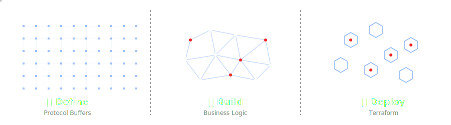

<p align="center">
  
</p>
<p align="center">
  <strong>Shared generated Go packages, upstream where needed, first-party where it matters.</strong>
</p>

# common-go

Generated Go packages for the shared Protocol Buffers contracts used across
Alis Build, plus the upstream-generated packages those contracts import
directly.

This repository is the Go module companion to
[`common-protos`](https://github.com/alis-exchange/common-protos). Where
`common-protos` is the schema source of truth, `common-go` is the published Go
distribution that consumers import from `go.alis.build/common`.

## Go packages in the Define, Build & Deploy framework

<p align="center">
  
</p>

Within the Alis Build platform, Protocol Buffers sit at the heart of the
Define, Build & Deploy (`DBD`) framework. This repository exists one step
downstream from that contract layer: it turns the shared protobuf definitions
into importable Go packages that services, clients, and internal platform code
can build against.

In `Define`, teams shape APIs and messages in `common-protos`.

In `Build`, this module provides the generated Go types, enums, service
stubs, and supporting metadata needed to implement or consume those contracts
without regenerating code in every repository.

In `Deploy`, shared generated packages help keep integrations predictable.
Multiple services can compile against the same published module path and stay
aligned on the same wire contract.

## At a Glance

This module has three distinct namespace groups:

| Namespace | Ownership        | Purpose                                        |
| --------- | ---------------- | ---------------------------------------------- |
| `alis/`   | Alis Build       | First-party generated Go packages              |
| `google/` | Google           | Vendored generated packages for imported protos |
| `lf/`     | Linux Foundation | Vendored generated Agent2Agent Go packages     |

The key distinction is that not every package in this repository is authored
here. Some generated packages are published only because first-party Alis
contracts import those upstream definitions and consumers benefit from one
stable module path.

## What Lives Here

### First-party generated packages

These packages are generated from protobuf definitions owned by Alis Build and
should evolve through the source protos in `common-protos`:

- `alis/a2a/...`
- `alis/open/...`
- `common/...`

Examples include packages such as:

- `go.alis.build/common/alis/open/support/v1`
- `go.alis.build/common/alis/a2a/extension/history/v1`
- `go.alis.build/common/common/test/v1`

### Vendored upstream generated packages

These packages are generated from upstream protobuf definitions that our
first-party APIs import directly:

- `google/`: common protobuf types, Google API annotations and service
  definitions, IAM, logging, RPC, long-running operations, and related support
  packages
- `lf/`: Linux Foundation Agent2Agent (`A2A`) protocol packages used as a
  baseline interoperability contract

## Relationship to `common-protos`

Use the repositories for different purposes:

- update `.proto` files and contract design in `common-protos`
- consume generated Go packages from `common-go`

If a contract changes upstream, this repository should be regenerated and
published so downstream Go consumers can pick up the new package version
through the module path:

```text
go.alis.build/common
```

## Importing Packages

Import the generated package you need directly from this module:

```go
import supportv1 "go.alis.build/common/alis/open/support/v1"
```

Because upstream dependencies are published under the same module, imports such
as these also resolve from this repository:

```go
import (
	iamv1 "go.alis.build/common/google/iam/v1"
	a2av1 "go.alis.build/common/lf/a2a/v1"
)
```

## Contribution Rules

Treat this repository as generated output and published module surface area.

- Make contract changes in `common-protos`, not by hand-editing generated `.pb.go`
  files here.
- Regenerate first-party packages when `alis/` or `common/` protobuf sources
  change upstream.
- Treat `google/` and `lf/` as vendored upstream code unless there is a very
  deliberate reason to refresh or patch them.
- Keep package paths stable. Breaking API changes should be reflected in the
  protobuf package versioning strategy upstream.

## Compatibility

For first-party packages published from this module:

- prefer additive changes
- avoid reusing protobuf field numbers
- version packages when making breaking changes
- document deprecations before removal

For vendored upstream packages:

- preserve upstream package names and import paths
- avoid unnecessary local divergence from the upstream source
